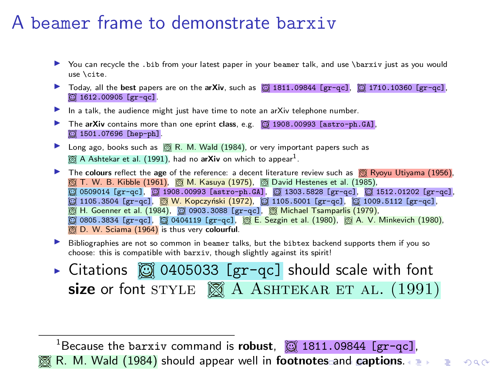

# :milky_way: Barxiv :milky_way:
## Beamer arXiv citations that catch the eye 
---
### Install and use
This is a very simple `LaTeX2e` package for the `beamer` class. Still a work in progress, if you want to have a go:
1. First make sure `biblatex` is handling your `.bib` file correctly (you can check with a `\cite{}` command), in my case I need to avoid `biber` (current incompatability through `TexLive`), so in my `.tex` file:
```
\usepackage[backend=bibtex,maxcitenames=1]{biblatex}
\addbibresource{<my_bibfile_name>.bib}
```
2. Download `barxiv.sty` and `barxiv_icons` to your `.tex` and `.bib` directory and add this to the **end** of your preamble:
```
\usepackage{barxiv}
```
3. Try putting `\barxiv{}` in place of `\cite{}`, twiddle the various options...
---
### Demonstration 
Here is a simple `beamer` frame to illustrate `barxiv` in use:

This frame was generated with `presentation.tex` as follows (note I don't include `presentation.bib`). The preamble explicitly contains all current `barxiv` options:
```
\documentclass{beamer}
\usepackage[utf8]{inputenc}
\usepackage[backend=bibtex,maxcitenames=1]{biblatex}
\addbibresource{presentation.bib}
\usepackage[hue angle today = 60, hue degrees per year = 2, saturation = 0.3, luminosity = 1.]{barxiv}
```
The body is much as you might expect:
```
\begin{document}
\tiny
\begin{frame}
  \frametitle{A frame to demonstrate \texttt{barxiv}}
  \begin{itemize}
    \item You can recycle the \texttt{.bib} from your latest paper in your \texttt{beamer} talk, and use \texttt{\symbol{92}barxiv} just as you would use \texttt{\symbol{92}cite}.
    \item Today, all the \textbf{best} papers are on the arXiv, such as \barxiv{2019JMP....60e2504B,2017CQGra..34t5006B,2017CQGra..34p7001B}.
    \item In a talk, the audience might just have time to note an arXiv telephone number.
    \item The arXiv contains more than one eprint class, e.g. \barxiv{2019arXiv190800993Y,2016IJMPS..4060010N}.
    \item Long ago, books such as \barxiv{1984ucp..book.....W}, or very important papers such as \barxiv{Ashtekar_1991}, had no arXiv on which to appear\footnote{Note citations such as \barxiv{2019JMP....60e2504B,1984ucp..book.....W} should scale with the font size automaticaly.}.
    \item The \textbf{colours} reflect the \textbf{age} of the reference: a decent literature review such as \barxiv{Einstein:1905ve,PhysRev.101.1597,1961JMP.....2..212K,1975NCimB..28..127K,1985AmJPh..53..510H,lasenby-doran-heineke-2005,2019arXiv190800993Y} is thus very \textbf{colourful}.
    \item Currently the \textbf{age} changes the \textbf{hue} angle: you can tweak the contemporary colour, hue degrees per year, saturation and luminosity (some time I might add colourmap functionality from the well-known \texttt{matplotlib} range).
    \item The \texttt{barxiv} command is \textbf{robust} and designed not to break over lines.
    \item The package \textbf{requires} and must be loaded \textbf{after} \texttt{biblatex}. 
    \item The package also requires the icons \texttt{prearxiv.png} and \texttt{postarxiv.png}.
    \item Bibliographies are not so common in \texttt{beamer} talks, but the \texttt{biblatex} functionality supports them if you so choose: this is compatible with \texttt{barxiv}, though slightly against its spirit!
  \end{itemize}
\end{frame}

\end{document}
```
---
### Tasks 
Things I want to do
- Get `matplotlib` colormap options to reflect age of reference
- Auto update of current year
- wrap it up and leave it on [CTAN](https://ctan.org/?lang=en)
